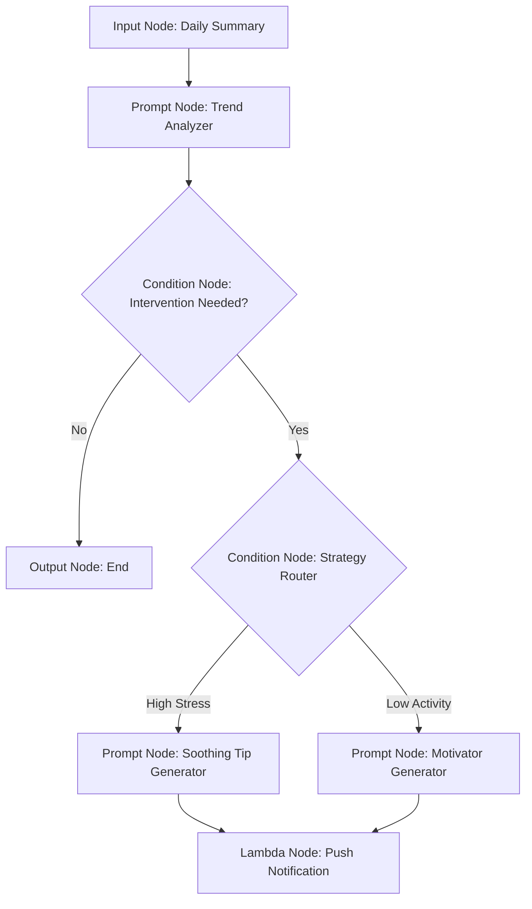

# ExecPlan: Bedrock Flows Migration & Proactive Coaching
**Status**: `PLANNED`
**Owner**: `Cloud Team`
**Date**: `2025-11-22`

## 1. Objective
Transition the current "Lambda Orchestrator" pattern to a robust **AWS Bedrock Flows** architecture. This will enable:
1.  **Advanced RAG**: Retrieval of long-term historical context (e.g., "How does this compare to my stress last month?").
2.  **Deterministic Safety**: Hard-coded guardrails against medical advice using Bedrock Guardrails attached to nodes.
3.  **Proactive Coaching Loop**: A secondary flow dedicated to generating *unsolicited* actionable tips based on subtle trend analysis, pushed to the Tamagotchi.

## 2. Architecture Overview

### Current State (Linear)
`Sensor Data` -> `Lambda` -> `Supervisor Agent (LLM)` -> `State Update`

### Future State (Flow-Based)
The architecture splits into two distinct flows managed by a Flow Alias.

#### Flow A: "State Reactor" (Real-time)
Triggered by significant sensor changes (e.g., HR spike).
```mermaid
graph TD
    A[Input Node: Sensor JSON] --> B{Condition Node: Safety Check}
    B -- Flagged --> C[Output Node: "Consult Doctor"]
    B -- Safe --> D[Knowledge Base Node: "Similar Past Events?"]
    D --> E[Prompt Node: Supervisor Logic]
    E --> F{Condition Node: Task Router}
    F -- Medical/Vitals --> G[Agent Node: Vitals Specialist]
    F -- Workout/Activity --> H[Agent Node: Activity Specialist]
    G --> I[Lambda Node: State Update]
    H --> I
```

#### Flow B: "Proactive Coach" (Async/Scheduled)
Triggered hourly or via "Quiet Mode" analysis.


## 3. Implementation Phases

### Phase 1: Infrastructure & Knowledge Base (Foundation)
*   [ ] **Vector DB Setup**: Deploy **OpenSearch Serverless** to store user health logs as vector embeddings.
*   [ ] **Ingestion Pipeline**: Create a Lambda to vectorize incoming daily summaries and store them in OpenSearch.
*   [ ] **Bedrock Knowledge Base**: Connect Bedrock to OpenSearch. Configure "Hybrid Search" for accuracy.

### Phase 2: The "State Reactor" Flow
*   [ ] **Flow Definition**: Create a `flow.json` definition using the Bedrock Flows JSON schema.
    *   **Input**: `type: Input` receiving sensor data.
    *   **Context**: `type: KnowledgeBase` querying past events.
    *   **Supervisor**: `type: Prompt` with `guardrailConfiguration` to filter medical advice.
    *   **Sub-Agents**: `type: Agent` nodes pointing to specialized Bedrock Agent Aliases.
*   [ ] **Integration**: Update the `orchestrator` Lambda to invoke the Flow ARN (`bedrock-agent-runtime.invoke_flow`) instead of the Agent Alias ID.

### Phase 3: The "Proactive Coach" Flow
*   [ ] **Trend Agent**: Create a specialized `Prompt` node focused on *subtle* patterns (e.g., "Sleep quality is degrading 5% per night this week").
*   [ ] **Strategy Logic**: Implement a `Condition` node:
    *   `conditions`: `[{ "expression": "#stressLevel > 80", "output": "SoothingNode" }, ...]`
*   [ ] **Feedback Loop**: Add a mechanism for the user to rate the tip (Thumps Up/Down) on the watch, feeding back into the Flow's future decision-making.

### Phase 4: Testing & Migration
*   [ ] **Shadow Mode**: Deploy the Flow alongside the current Agent. Log outputs of both for 24h and compare quality.
*   [ ] **Safety Red-Teaming**: Intentionally flood the Flow with "medical emergency" data to ensure the Guardrail attached to the Supervisor Node terminates correctly.
*   [ ] **Cutover**: Switch the production Lambda to point to the Flow Alias.

## 4. Technical Components

| Component | Service | Purpose |
| :--- | :--- | :--- |
| **Flow Engine** | AWS Bedrock Flows | Visual orchestration of the DAG (Directed Acyclic Graph). |
| **Long-term Memory** | OpenSearch Serverless | Vector store for historical health context (RAG). |
| **Safety** | Bedrock Guardrails | PII redaction and Topic filtering attached to `Prompt` and `KB` nodes. |
| **Action Handler** | Lambda Node | The "Hands" of the flow (DB writes, Push Notifications). |
| **Router** | Condition Node | Branching logic based on input data or LLM output. |

## 5. Risks & Mitigation
*   **Latency**: Flows can add overhead. *Mitigation*: Keep "State Reactor" flow simple; offload deep analysis to the async "Proactive Coach" flow.
*   **Cost**: Vector DB and complex chains increase token usage. *Mitigation*: Use smaller models (Haiku) for the initial filtering/routing nodes, reserving Sonnet/Opus for the final synthesis.