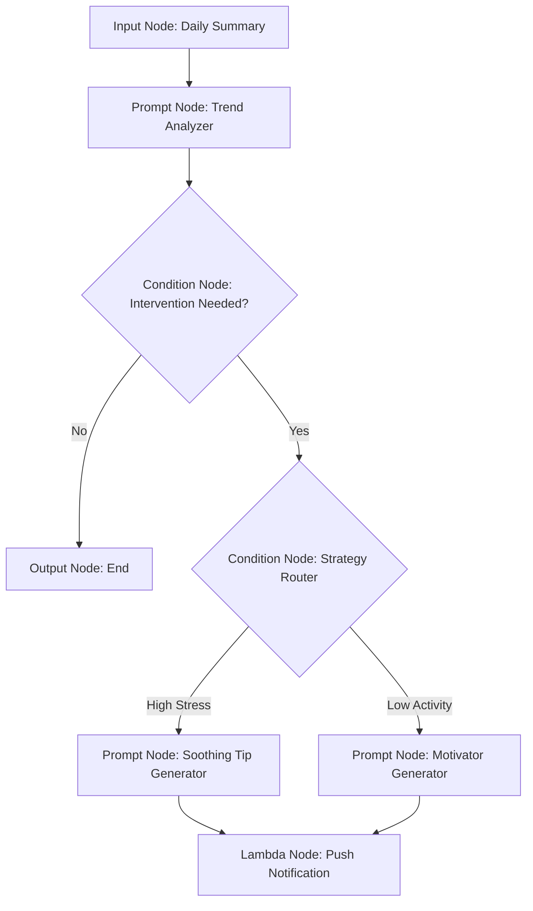

# ExecPlan: Bedrock Flows Migration & Proactive Coaching
**Status**: `PLANNED`
**Owner**: `Cloud Team`
**Date**: `2025-11-22`

## 1. Objective
Transition the current "Lambda Orchestrator" pattern to a robust **AWS Bedrock Flows** architecture. This will enable:
1.  **Advanced RAG**: Retrieval of long-term historical context (e.g., "How does this compare to my stress last month?").
2.  **Deterministic Safety**: Hard-coded guardrails against medical advice using Bedrock Guardrails attached to nodes.
3.  **Proactive Coaching Loop**: A secondary flow dedicated to generating *unsolicited* actionable tips based on subtle trend analysis, pushed to the Tamagotchi.

## 2. Architecture Overview

### Current State (Linear)
`Sensor Data` -> `Lambda` -> `Supervisor Agent (LLM)` -> `State Update`

### Future State (Flow-Based)
The architecture splits into two distinct flows managed by a Flow Alias.

#### Flow A: "State Reactor" (Real-time)
Triggered by significant sensor changes (e.g., HR spike).
```mermaid
graph TD
    A[Input Node: Sensor JSON] --> B{Condition Node: Safety Check}
    B -- Flagged --> C[Output Node: "Consult Doctor"]
    B -- Safe --> D[Knowledge Base Node: "Similar Past Events?"]
    D --> E[Prompt Node: Supervisor Logic]
    E --> F{Condition Node: Task Router}
    F -- Medical/Vitals --> G[Agent Node: Vitals Specialist]
    F -- Workout/Activity --> H[Agent Node: Activity Specialist]
    G --> I[Lambda Node: State Update]
    H --> I
```

#### Flow B: "Proactive Coach" (Async/Scheduled)
Triggered hourly or via "Quiet Mode" analysis.


## 3. Implementation Phases (Pivoted to Direct Model Invocation)

### Phase 1: Core Orchestrator & Model Integration
*   [x] **Direct Model Invocation**: Orchestrator Lambda (`agentic_loop.py`) now directly calls `bedrock_runtime.converse` using a specified `MODEL_ID`.
*   [x] **IAM Permissions**: Lambda execution role (`lambda_role`) configured with `bedrock:InvokeModel` permissions.
*   [x] **Context Retriever Integration**: Orchestrator invokes `context_retriever` Lambda to fetch historical data and includes it in model prompts.
*   [x] **Structured Output**: Model prompts designed for JSON output, and Orchestrator parses this output.

### Phase 2: State Reactor (Real-time Analysis)
*   [x] **Logic Implementation**: `run_state_reactor` function in `agentic_loop.py` handles real-time sensor data analysis, state determination, and updates.
*   [x] **Trigger Mechanism**: Triggered by incoming sensor data events (e.g., via API Gateway or other Lambda invokes).

### Phase 3: Proactive Coach (Async/Scheduled Analysis)
*   [x] **Logic Implementation**: `run_proactive_coach` function in `agentic_loop.py` iterates through users, fetches history, and generates proactive tips using a dedicated model prompt.
*   [x] **Trigger Mechanism**: CloudWatch Event Rule triggers Orchestrator hourly to run `run_proactive_coach`.

### Phase 4: Testing & Validation
*   [x] **Unit Testing**: Local testing script (`scripts/test_model.py`) verifies direct model invocation, context integration, and state updates.
*   [ ] **Safety Validation**: Implement mechanisms (e.g., input filtering, output validation) to ensure model responses are safe and adhere to guidelines (e.g., no medical advice).
*   [ ] **Refinement**: Iterate on model prompts and inference parameters for optimal performance and pet behavior.

## 4. Technical Components

| Component | Service | Purpose |
| :--- | :--- | :--- |
| **Flow Engine** | AWS Bedrock Flows | Visual orchestration of the DAG (Directed Acyclic Graph). |
| **Long-term Memory** | OpenSearch Serverless | Vector store for historical health context (RAG). |
| **Safety** | Bedrock Guardrails | PII redaction and Topic filtering attached to `Prompt` and `KB` nodes. |
| **Action Handler** | Lambda Node | The "Hands" of the flow (DB writes, Push Notifications). |
| **Router** | Condition Node | Branching logic based on input data or LLM output. |

## 5. Risks & Mitigation
*   **Latency**: Flows can add overhead. *Mitigation*: Keep "State Reactor" flow simple; offload deep analysis to the async "Proactive Coach" flow.
*   **Cost**: Vector DB and complex chains increase token usage. *Mitigation*: Use smaller models (Haiku) for the initial filtering/routing nodes, reserving Sonnet/Opus for the final synthesis.